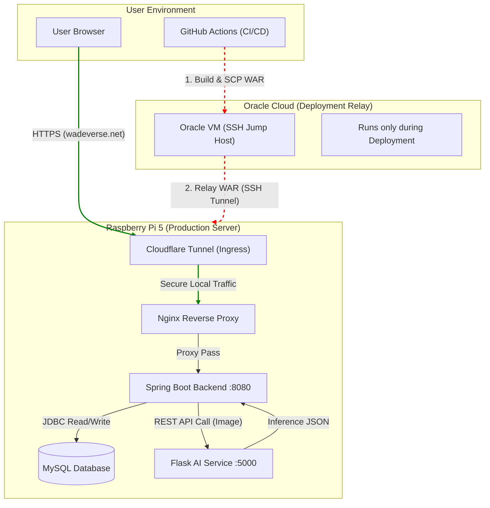

# Calories Cut – AI-Powered Health Tracking Platform
🔗 [Live Demo](https://health.wadeverse.net/) | 🔗 [API Service](https://health-api.wadeverse.net/)


---

## Project Overview
**Calories Cut** is a full-stack web application designed to automate dietary tracking using Computer Vision.
Unlike simple CRUD apps, this project focuses on **end-to-end system architecture**—integrating a Java Spring backend, a Python AI microservice, and a self-hosted Linux infrastructure.

The goal was to build a **production-grade system** that handles real-time image inference, complex data relationships, and automated deployments.

---

## System Architecture & Infrastructure

This project implements a **Hybrid Cloud & Edge Architecture** to optimize cost and performance.



### Infrastructure Highlights
* **Self-Hosted Server:** Configured a **Raspberry Pi 5** as a production server, managed via **SSH** and **Linux (Ubuntu)**.
* **Network Security:** Implemented **Cloudflare Tunnel** to expose local services securely (HTTPS) without opening vulnerable ports on the router.
* **Process Management:** Used **PM2** to ensure zero-downtime for Node.js and Python services, with automated log rotation.
* **CI/CD Pipeline:** Automated deployment using **GitHub Actions**, pushing artifacts to Oracle VM and syncing with the Edge Server.

---

## Tech Stack

| Domain | Technologies |
| :--- | :--- |
| **Backend** | Java (Spring MVC), MyBatis, Maven |
| **AI Microservice** | Python, Flask, TensorFlow/Keras, OpenCV |
| **Database** | MySQL (Normalized Schema, Complex JOINs) |
| **Frontend** | JSP, JSTL, jQuery (AJAX), Chart.js, Bootstrap |
| **DevOps** | Linux (Ubuntu), Nginx, Cloudflare Tunnel, PM2, GitHub Actions |

---

## Key Features & Engineering

### 1. Backend Architecture (Spring MVC)
* **Modular Design:** Strictly followed `Controller` → `Service` → `DAO` layers to separate business logic from data access.
* **Transaction Management:** Applied `@Transactional` annotations to ensure data integrity during multi-step processes (e.g., saving image metadata + updating user logs).
* **Session Security:** Implemented `HttpSession` interceptors to protect sensitive routes and manage user authentication states.

### 2. AI Integration (Flask + TensorFlow)
* **Microservice Pattern:** Decoupled the heavy AI inference logic (Python) from the main web server (Java) to prevent blocking threads.
* **Model Optimization:** Trained a custom CNN model on 3,200+ images and converted it to **TFLite** with XNNPACK delegates for faster inference on ARM architecture (Raspberry Pi).

### 3. Database Modeling
* Designed a relational schema with **7+ entities** (Users, Diaries, Images, Nutrition, Exercise, Goals, etc.).
* Optimized SQL queries using **MyBatis Dynamic SQL** to handle complex filtering and aggregation (e.g., "Weekly Calorie Avg").

---

## Technical Challenges Solved

### Issue 1: AI Model Accuracy & Overfitting
* **Problem:** Initial model had <50% accuracy due to noisy dataset.
* **Solution:** Applied **Data Augmentation** (rotation, zoom) and implemented **EarlyStopping** & **Dropout (0.5)** layers.
* **Result:** Achieved **82.5% accuracy** on validation data.

### Issue 2: Full-Stack Integration Mismatch
* **Problem:** Passing `MultipartFile` images from Spring to Flask caused encoding errors.
* **Solution:** Standardized JSON communication and implemented proper multipart-form handling in the Flask endpoint using `werkzeug`.

### Issue 3: Deployment Reliability
* **Problem:** The Python server would occasionally crash due to memory spikes.
* **Solution:** Deployed the service using **PM2**, configuring auto-restart policies and memory limits to ensure 24/7 availability.

---

## Screenshots

### Start Page


### Main Page


### Recipe Page


### Recipe Detail Page


### News Page


### Exercise Page


### Diary Page


### Machine Learning Result


---

## How to Run

### Prerequisites
* Java 17+, Maven, MySQL 8.0
* Python 3.10+

### Backend Setup
```bash
git clone [https://github.com/humanwade/healthML.git](https://github.com/humanwade/healthML.git)
cd healthML
# Configure src/main/resources/application-dev.properties
mvn clean package
java -jar target/healthML-0.0.1.war
```

### AI Server Setup
```bash
cd flask-api
pip install -r requirements.txt
python3 photoDBinsert.py
```

---

## Future Improvements
* **Migration to Docker:** Containerize Spring and Flask apps for easier orchestration.
* **Responsive UI:** Refactor frontend using **React** for a true SPA experience.
* **Expanded Dataset:** Increase food categories from 12 to 50+.
